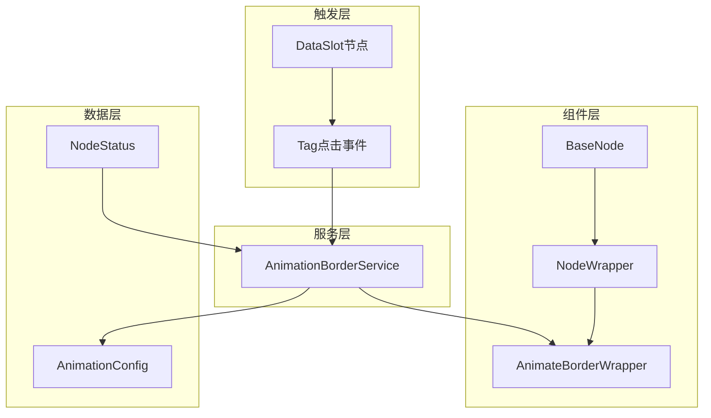
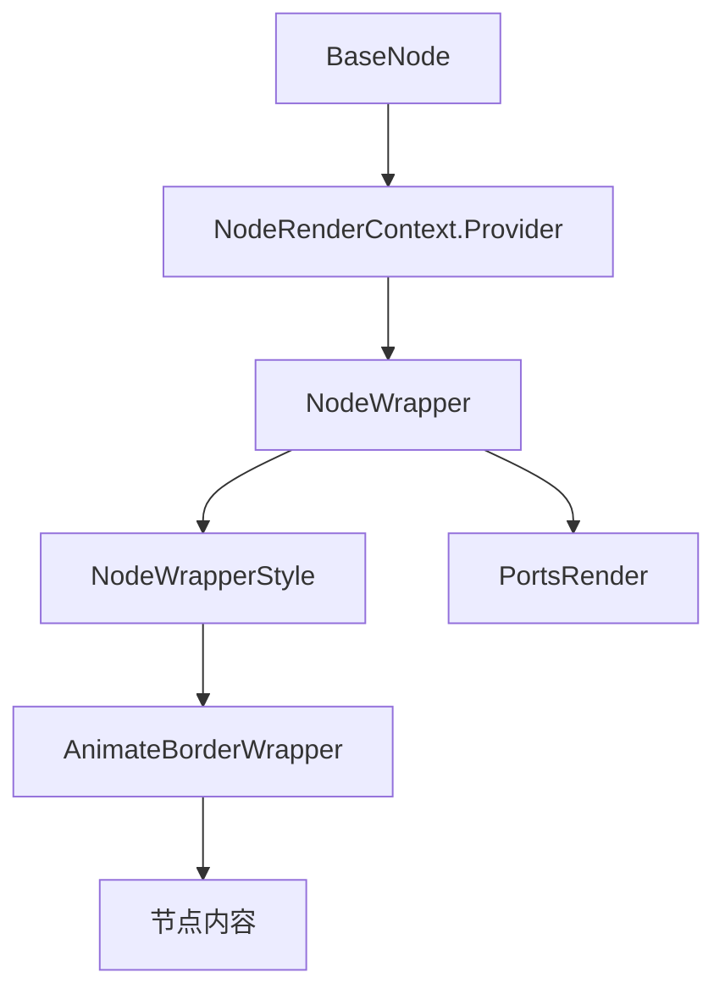
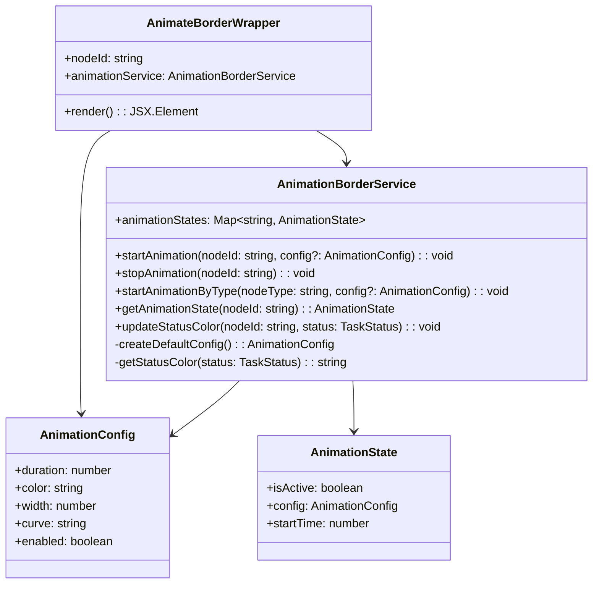
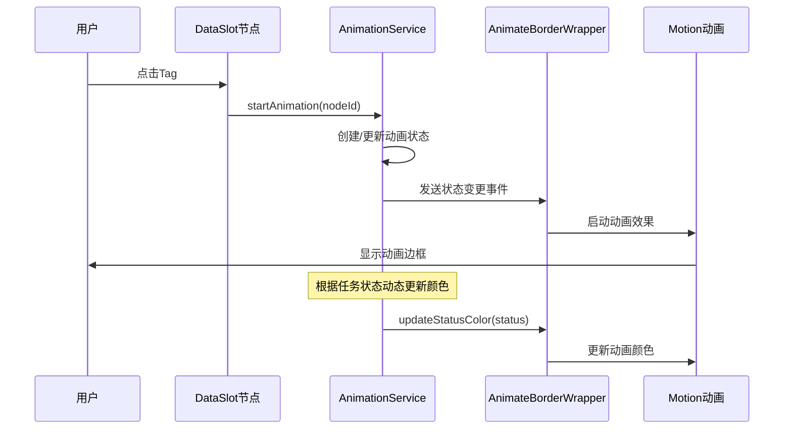

# 节点动画边框效果设计文档

## 概述

本设计方案为FlowGram.AI项目中的节点添加可配置的动画边框效果，使用motion框架实现流畅的动画体验。该功能将通过服务化架构提供统一的动画控制能力，支持根据节点ID或类型进行精准控制，并能根据任务状态动态设置边框颜色。

## 技术栈

- **前端框架**: React 18 + TypeScript
- **动画库**: motion ~12.23.12
- **UI组件**: styled-components
- **依赖注入**: @flowgram.ai/free-layout-editor IOC容器
- **构建工具**: Rsbuild

## 架构设计

### 整体架构



### 组件层级结构



### 核心组件关系



## 组件设计

### 1. AnimateBorderWrapper 组件

动画边框包装组件，使用motion框架实现边框动画效果。

**属性接口**:
```typescript
interface AnimateBorderWrapperProps {
  nodeId: string;
  children: React.ReactNode;
  className?: string;
}
```

**功能特性**:
- 响应式动画状态监听
- 基于motion的流畅动画效果
- 可配置的动画参数
- 自动状态颜色映射

### 2. AnimationBorderService 服务

提供统一的动画控制和状态管理能力。

**核心方法**:
- `startAnimation(nodeId, config?)`: 启动指定节点的动画
- `stopAnimation(nodeId)`: 停止指定节点的动画
- `startAnimationByType(nodeType, config?)`: 按节点类型批量启动动画
- `updateStatusColor(nodeId, status)`: 根据状态更新动画颜色

**服务特性**:
- 基于IOC容器的依赖注入
- 集中化的动画状态管理
- 支持节点ID和类型两种匹配模式
- 状态驱动的颜色动态更新

## 数据模型

### AnimationConfig 配置模型

```typescript
interface AnimationConfig {
  duration: number;        // 动画时长(ms)
  color: string;          // 边框颜色
  width: number;          // 边框宽度(px)
  curve: string;          // 动画曲线
  enabled: boolean;       // 是否启用
}
```

### 状态颜色映射

```typescript
enum TaskStatus {
  PENDING = 'pending',
  RUNNING = 'running',
  SUCCESS = 'success',
  FAILED = 'failed',
  CANCELLED = 'cancelled'
}

const StatusColors: Record<TaskStatus, string> = {
  [TaskStatus.PENDING]: '#FFA500',    // 橙色 - 等待中
  [TaskStatus.RUNNING]: '#00BFFF',    // 深天蓝 - 运行中
  [TaskStatus.SUCCESS]: '#32CD32',    // 酸橙绿 - 成功
  [TaskStatus.FAILED]: '#FF4500',     // 橙红色 - 失败
  [TaskStatus.CANCELLED]: '#808080'   // 灰色 - 已取消
}
```

## 集成方案

### 实现架构

AnimateBorderWrapper组件在NodeWrapper层级下集成：

```typescript
// NodeWrapper组件集成方案
export const NodeWrapper: React.FC<NodeWrapperProps> = (props) => {
  const { children, isScrollToView = false } = props;
  const nodeRender = useNodeRenderContext();
  const { node } = nodeRender;

  return (
    <>
      <NodeWrapperStyle>
        <AnimateBorderWrapper nodeId={node.id}>
          {children}
        </AnimateBorderWrapper>
      </NodeWrapperStyle>
      {portsRender}
    </>
  );
};
```

### 1. 服务注册

在编辑器初始化时注册AnimationBorderService：

```typescript
// hooks/use-editor-props.tsx
onBind: ({ bind }) => {
  bind(CustomService).toSelf().inSingletonScope();
  bind(WebSocketService).toSelf().inSingletonScope();
  bind(AnimationBorderService).toSelf().inSingletonScope(); // 新增
}
```

### 2. 触发机制

在DataSlot节点的tag点击事件中调用动画服务：

```typescript
const onTagClick = useCallback((event, title, value) => {
  // 原有逻辑...

  // 新增动画触发
  const animationService = useService(AnimationBorderService);
  animationService.startAnimation(currentNode.id);
}, []);
```

## 交互流程

### 动画触发流程


